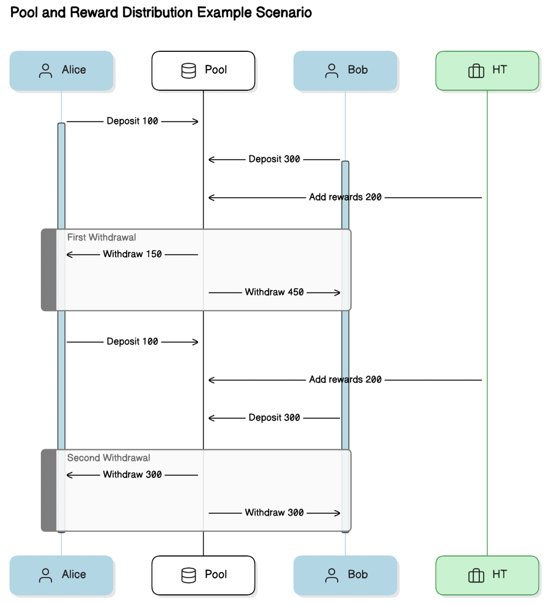

# STLHarvest Challenge

Test to create STLHarvest offers a platform enabling users to deposit STL tokens to earn weekly
incentives. Participants should have the flexibility to withdraw their initial investments
and corresponding reward shares whenever they choose.

By Jeftar Mascarenhas

## Env variables

If you using mainnets or test networks

```shell
npx hardhat vars set RPC_API_KEY
npx hardhat vars set HR_TEAM_PRIVATE_KEY
npx hardhat vars set ETHERSCAN_API_KEY
```

## Docker

```shell
docker build . -t hrteam
docker run hrteam
```

## Custom Scripts

```shell
npm run test:watch
npm run start:dev
npm run deploy:dev
npm run chain
npm run clean
npm run clean
```

## Custom Tasks

```shell
npx hardhat balance --choose-network localhost --network localhost
 npx hardhat balance --choose-network sepolia --network sepolia
```

## Hardhat Tasks

```shell
npx hardhat help
npx hardhat test
REPORT_GAS=true npx hardhat test
npx hardhat node
npx hardhat ignition deploy ./ignition/modules/Lock.ts
```

## Contracts

Contracts deployed on Sepolia network

- [STL Token Sepolia](https://sepolia.etherscan.io/address/0xD53a06CfA828a622388E7792dFc7B9368B61e959#code) [x]
- [STL Harvest Poll Sepolia](https://sepolia.etherscan.io/address/0xD53a06CfA828a622388E7792dFc7B9368B61e959#code) [x]

## Behavioral Diagram


